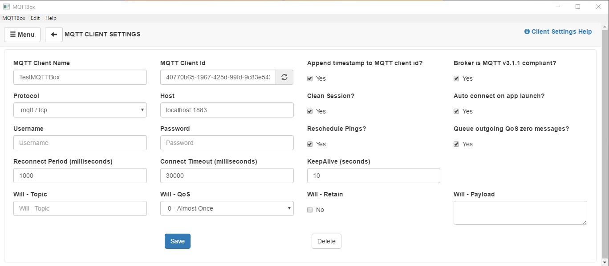

# meow-mix
An API driven dashboard for my ESP8266 based automatic pet feeder project.

## Getting the ESP8266 configured 
1. Add the PubSubClient to your sketch. The controller needs a library for communication with the MQTT broker. Check out [PubSubClient](https://github.com/knolleary/pubsubclient/releases/tag/v2.7) for more info. This can be accomplished by downloading the library and placing it into your OS's global Arduino library directory. On Win10, this was `Documents\Arduino\libraries\PubSubClient`. Can also be automatically installed when using VSCode by using the `Library Manager` command.

This project uses the MQTT protocol in order to communicate with the ESP8266. Recall that there needs to be a server, somewhere, running an MQTT Server. There are a couple of nice options here:

1. http://broker.mqtt-dashboard.com/ a famous public server you can connect to -- or even run your IoT device off of for free
2. Run locally - I've found the HiveMQ docker container to be a great option. 

### ESP8266 VSCode Config
The free Arduino is great, however, if you prefer to use VSCode you can install the Arduino extension. When the extension finds your `.ino` file it will allow you to configure your board type as well as the programmer and serial port. 

> NOTE: On Windows 10 I needed to add the `ESP8266` "Board Package" in order for this to work.

The generated `.vscode/arduino.json` file will look something like this:

```json
{
    "port": "COM6",
    "board": "esp8266:esp8266:nodemcuv2",
    "configuration": "xtal=80,vt=flash,exception=legacy,ssl=all,eesz=4M2M,led=2,ip=lm2f,dbg=Disabled,lvl=None____,wipe=none,baud=115200",
    "programmer": "AVRISP mkII",
    "sketch": "CatFeeder.ino",
    "output": "../build"
}
```

## Testing the message broker locally
[HiveMQ offers a Docker solution](https://www.hivemq.com/downloads/docker/) that will have you up and running in seconds.

`docker run -p 8080:8080 -p 1883:1883 hivemq/hivemq4`

* You can navigate your browser to `http://localhost:8080` and open the HiveMQ Control Center. If the HiveMQ Control Center is available, HiveMQ is up and running. You can login with the default credentials (user: `admin` password: `hivemq`)
* Any MQTT client can connect to the container. I'm using MQTTBox to test out the broker:

* Set the protocol to `mqtt/tcp` and the Host to `localhost:1883` (or whatever port you exposed when you ran the container) and click on `Save`